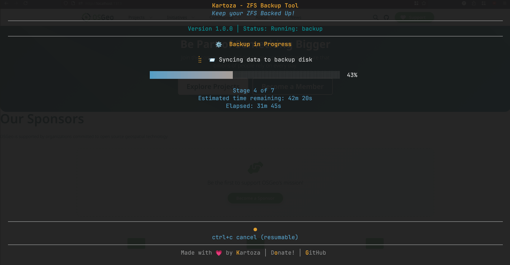

# 🗄️ Kartoza ZFS Backup Tool

A beautiful TUI (Terminal User Interface) for managing ZFS backups, built with [Bubble Tea](https://github.com/charmbracelet/bubbletea) and [Lipgloss](https://github.com/charmbracelet/lipgloss).



## Features

- 📦 **Incremental Backups** - Efficient snapshots with syncoid integration
- 🔥 **Force Backup** - Destructive backup option for out-of-sync scenarios
- 📥 **Restore Files** - Dual-panel file explorer to browse snapshots and restore files
- 🔧 **Device Preparation** - Create encrypted ZFS pools with AES-256-GCM
- 🔌 **Safe Unmounting** - Properly export pools and power off USB drives
- 🎨 **Beautiful TUI** - Intuitive interface with progress indicators and styled output
- ⌨️  **CLI Mode** - Command-line arguments for automation and scripting

## Requirements

- ZFS filesystem with at least one pool (source)
- [syncoid](https://github.com/jimsalterjrs/sanoid) (from sanoid package)
- Root privileges (via sudo) OR ZFS delegation configured for your user
- External drive with an encrypted ZFS pool (destination)

## Installation

### Method 1: NixOS Module (Recommended)

Add to your `flake.nix`:

```nix
{
  inputs = {
    nixpkgs.url = "github:NixOS/nixpkgs/nixos-unstable";
    zfs-backup.url = "github:timlinux/zfs-backup";
  };

  outputs = { self, nixpkgs, zfs-backup, ... }: {
    nixosConfigurations.myhost = nixpkgs.lib.nixosSystem {
      system = "x86_64-linux";
      modules = [
        # Import the module
        zfs-backup.nixosModules.default
        # Add the overlay so pkgs.zfs-backup is available
        { nixpkgs.overlays = [ zfs-backup.overlays.default ]; }

        ./configuration.nix
      ];
    };
  };
}
```

Then in your `configuration.nix`:

```nix
{ config, pkgs, ... }:
{
  # Enable the service (adds package to systemPackages)
  services.zfs-backup.enable = true;
}
```

### Method 2: Direct Package Installation

If you don't need the module features, just add the overlay:

```nix
{
  inputs = {
    nixpkgs.url = "github:NixOS/nixpkgs/nixos-unstable";
    zfs-backup.url = "github:timlinux/zfs-backup";
  };

  outputs = { self, nixpkgs, zfs-backup, ... }: {
    nixosConfigurations.myhost = nixpkgs.lib.nixosSystem {
      system = "x86_64-linux";
      modules = [
        { nixpkgs.overlays = [ zfs-backup.overlays.default ]; }
        ./configuration.nix
      ];
    };
  };
}
```

Then in `configuration.nix`:

```nix
{ config, pkgs, ... }:
{
  environment.systemPackages = [ pkgs.zfs-backup ];
}
```

### Run Without Installing

```bash
nix run github:timlinux/zfs-backup
```

### Building from Source

```bash
git clone https://github.com/timlinux/zfs-backup
cd zfs-backup
nix build
./result/bin/zfs-backup
```

## Usage

### Interactive Mode

Simply run without arguments to launch the TUI:

```bash
sudo zfs-backup
```

Navigate using arrow keys, select options with Enter.

**Note:** If you have ZFS delegation configured for your user, you can run without sudo.

### CLI Mode

For automation and scripting:

```bash
# Run incremental backup
sudo zfs-backup --backup

# Force backup (destructive)
sudo zfs-backup --force-backup

# Unmount backup disk
sudo zfs-backup --unmount

# Show help
zfs-backup --help
```

**Note:** If you have ZFS delegation configured, you can omit `sudo`.

## Operations

### 📦 Incremental Backup

Performs an incremental backup using syncoid:

1. Imports and unlocks the NIXBACKUPS pool
2. Creates a timestamped snapshot of NIXROOT/home
3. Syncs snapshots incrementally to NIXBACKUPS/home
4. Prunes old local snapshots (keeps last 7)
5. Prunes old backup snapshots (keeps last 3 months)
6. Generates a backup health report
7. Safely exports the pool and powers off the drive

### 🔥 Force Backup

Forces a complete backup by deleting previous snapshots on the backup disk. Use this when local and backup are out of sync.

⚠️ **Warning**: This is a destructive operation!

### 🔧 Prepare Backup Device

Creates an encrypted ZFS pool on a new external drive:

- Prompts for device path (e.g., `/dev/sda`)
- Requires double confirmation
- Creates NIXBACKUPS pool with:
  - AES-256-GCM encryption
  - Passphrase authentication
  - ZSTD compression
  - Optimized atime settings

⚠️ **Warning**: This will erase all data on the device!

### 📥 Restore Files

Browse snapshots and restore files using a dual-panel file explorer:

- Select source pool (containing snapshots) and destination
- View all snapshots with timestamps and sizes
- Navigate into snapshots to browse files
- Select files with spacebar, copy with 'y' (yank)
- Vim/yazi-style keybindings (hjkl, g/G, Ctrl+u/d)

### 🔌 Unmount Backup Disk

Safely exports the NIXBACKUPS pool and powers off the USB drive. Always use this before unplugging the backup drive to prevent data corruption.

## Configuration

The tool works with the following ZFS pool structure:

- **NIXROOT/home** - Local ZFS filesystem to backup
- **NIXBACKUPS/home** - External backup destination

### Running Without Sudo (Optional)

If you prefer not to use sudo, you can configure ZFS delegation to allow your user to perform the necessary operations:

```bash
# Allow your user to perform ZFS operations on NIXROOT and NIXBACKUPS
sudo zfs allow -u $USER snapshot,send,receive,mount,create,destroy NIXROOT
sudo zfs allow -u $USER snapshot,send,receive,mount,create,destroy,load-key NIXBACKUPS

# Allow pool import/export operations
sudo zpool set delegation=on NIXROOT
sudo zpool set delegation=on NIXBACKUPS
```

**Note:** Pool operations (import/export) and some encryption operations may still require root privileges even with delegation configured. For most users, running with `sudo` is the simplest approach.

## Keyboard Shortcuts

### Main Menu

| Key | Action |
|-----|--------|
| ↑/k ↓/j | Navigate menu |
| Enter | Select option |
| y/n | Confirm/Cancel |
| Esc | Go back |
| q | Quit application |
| Ctrl+C | Force quit |

### Restore Mode

| Key | Action |
|-----|--------|
| h/l or Tab | Switch panels |
| j/k | Navigate up/down |
| Enter | Enter directory/snapshot |
| Space | Toggle file selection |
| y | Yank (copy) selected files |
| / | Search |
| s | Cycle sort mode |
| u | Unmount and power off |
| q/Esc | Return to menu |

## Development

Enter the development shell:

```bash
nix develop
```

Build and run:

```bash
go build
./zfs-backup
```

## Architecture

```
zfs-backup/
├── main.go       # Bubble Tea TUI and main application logic
├── zfs.go        # ZFS operations (backup, prepare, unmount)
├── state.go      # Backup state management for resume
├── restore.go    # Restore mode with dual-panel explorer
├── package.nix   # Nix package definition
├── flake.nix     # Nix flake configuration
└── go.mod        # Go module dependencies
```

## Dependencies

### Go Libraries

- [Bubble Tea](https://github.com/charmbracelet/bubbletea) - TUI framework
- [Bubbles](https://github.com/charmbracelet/bubbles) - TUI components
- [Lipgloss](https://github.com/charmbracelet/lipgloss) - Style definitions

### System Dependencies

- ZFS utilities
- syncoid (from sanoid)
- udisks2

## License

MIT License - see LICENSE file for details

## Author

Tim Sutton ([@timlinux](https://github.com/timlinux))

## Contributing

Contributions are welcome! Please feel free to submit a Pull Request.

---

Made with 💗 by [Kartoza](https://kartoza.com) | [Donate!](https://github.com/sponsors/kartoza) | [GitHub](https://github.com/kartoza/zfs-backup)
