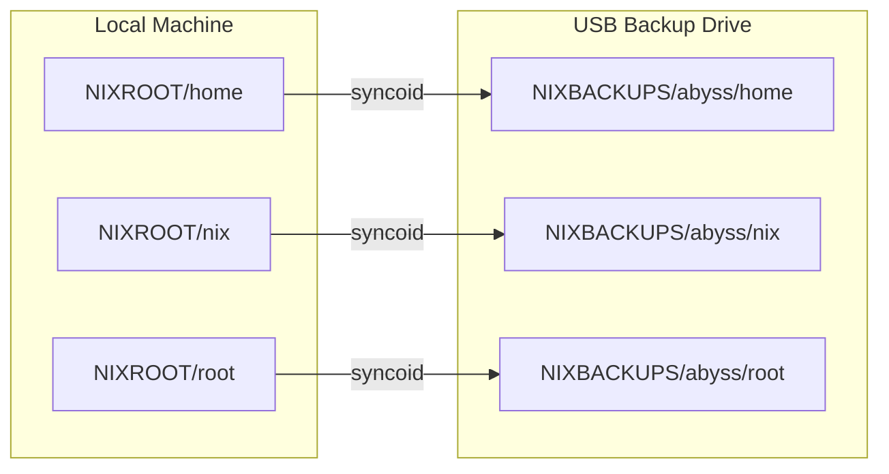
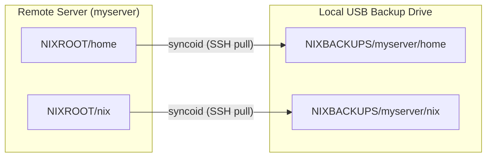
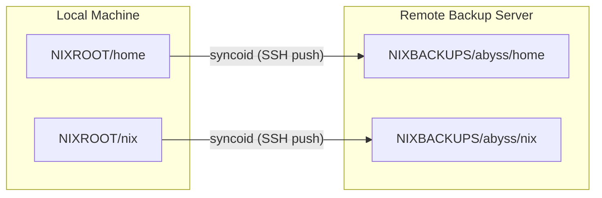
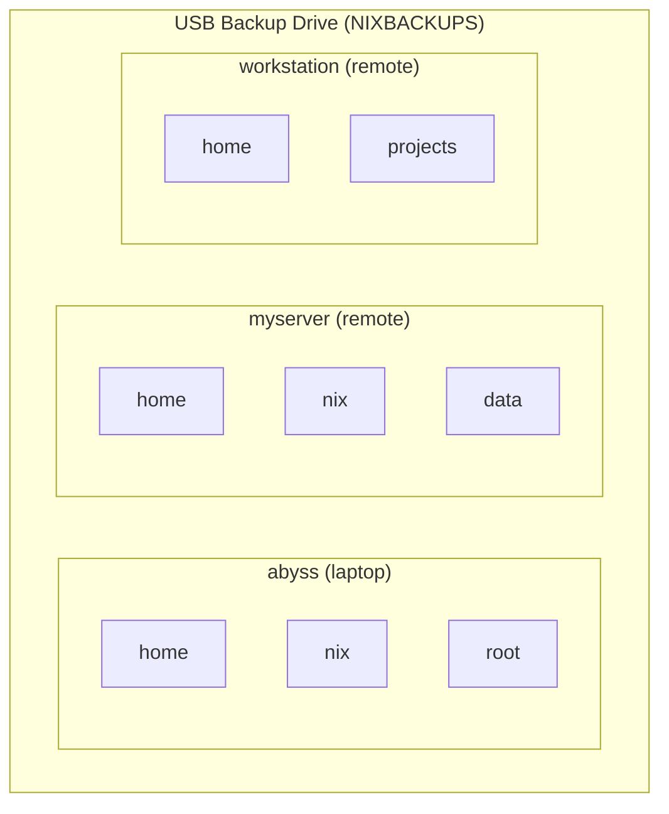

# Kartoza ZFS Backup Tool

A beautiful TUI (Terminal User Interface) for managing ZFS backups, built with [Bubble Tea](https://github.com/charmbracelet/bubbletea) and [Lipgloss](https://github.com/charmbracelet/lipgloss).

[](https://github.com/timlinux/zfs-backup/releases)
[](LICENSE)
[](https://timlinux.github.io/zfs-backup/)

📖 **[Full Documentation](https://timlinux.github.io/zfs-backup/)**

## Features

- **Incremental Backups** - Efficient snapshots of ALL datasets with syncoid integration
- **Multi-Host Backups** - Back up multiple machines to the same drive with hostname namespacing
- **Pull Remote Backup** - Pull ZFS snapshots from remote servers via SSH
- **Push Backup to Remote** - Push local snapshots to a remote backup server via SSH
- **Force Backup** - Destructive backup option for out-of-sync scenarios
- **Restore Files** - Dual-panel file explorer to browse snapshots and restore files
- **Pool Information** - View detailed pool structure, health, datasets, and snapshots
- **Pool Maintenance** - Start, stop, and monitor scrub operations
- **Device Preparation** - Create encrypted ZFS pools with AES-256-GCM
- **Safe Unmounting** - Properly export pools and power off USB drives
- **Smart Pool Defaults** - Auto-detects source/destination pools based on naming
- **Saved Host Profiles** - Remote hosts are persisted for quick reuse
- **CLI Mode** - Command-line arguments for automation and scripting

## Backup Modalities

### Local Backup (to external USB drive)



### Pull Remote Backup (remote server to local drive)



### Push Backup (local to remote backup server)



### Multi-Host on Same Drive



All datasets — including application-managed datasets without a regular mountpoint, such as `atuin` — are namespaced by hostname so multiple machines can share one backup drive without conflicts. Every backup target lives under `NIXBACKUPS/<hostname>/<dataset>` (for example `NIXBACKUPS/abyss/home`, `NIXBACKUPS/abyss/atuin`).

**Automatic migration from the legacy flat layout.** Earlier versions wrote some datasets to a flat path such as `NIXBACKUPS/home`. At the start of every backup, the tool detects any remaining flat-layout datasets and atomically renames them into the hostname namespace (`zfs rename NIXBACKUPS/home NIXBACKUPS/<hostname>/home`). If a dataset already exists at *both* the flat and the namespaced location the migration aborts with a clear error so you can resolve the conflict manually — the backup will never silently merge or destroy snapshots.

## Quick Start

### Install

```bash
# Download binary (Linux x86_64)
curl -L https://github.com/timlinux/zfs-backup/releases/latest/download/zfs-backup-linux-amd64 -o zfs-backup
chmod +x zfs-backup
sudo mv zfs-backup /usr/local/bin/

# Or with Nix
nix run github:timlinux/zfs-backup
```

See [Installation Guide](https://timlinux.github.io/zfs-backup/admin-guide/installation/) for more options including NixOS, Arch (AUR), Debian, Fedora, Snap, and Flatpak.

### Run

```bash
# Interactive mode
sudo zfs-backup

# CLI mode
sudo zfs-backup --backup      # Run incremental backup
sudo zfs-backup --unmount     # Safely unmount backup drive
sudo zfs-backup --help        # Show help
```

## Requirements

- Linux with ZFS filesystem
- [syncoid](https://github.com/jimsalterjrs/sanoid) (from sanoid package)
- Root privileges or ZFS delegation configured
- External drive with encrypted ZFS pool (for backups)

## Menu Options

| Option | Description |
|--------|-------------|
| Backup ZFS (incremental) | Run efficient incremental backup of all local datasets |
| Pull Remote Backup | Pull backup from a remote host via SSH |
| Push Backup to Remote | Push local snapshots to a remote backup server |
| Restore Files | Browse snapshots and restore individual files |
| Show zpool info | View pool structure, health, datasets, and snapshots |
| Pool Maintenance | Start/stop scrubs, monitor pool health |
| Recover Failed Backup | Fix broken sync state after interruption |
| Unmount Backup Disk | Safely export pool and power off USB drive |
| Prepare Backup Device | Create new encrypted ZFS pool on external drive |
| Force Backup (destructive) | Reset backup when incremental chain is broken |

## Keyboard Shortcuts

### Navigation
| Key | Action |
|-----|--------|
| `↑/k` `↓/j` | Navigate |
| `Enter` | Select |
| `Esc` | Go back |
| `q` | Quit |

### Scrollable Views (Pool Info, Maintenance, Results)
| Key | Action |
|-----|--------|
| `j/k` | Scroll line |
| `Ctrl+u/d` | Page up/down |
| `g/G` | Top/bottom |

### Restore Mode
| Key | Action |
|-----|--------|
| `Tab` or `h/l` | Switch panels |
| `Space` | Toggle selection |
| `y` | Copy selected files |
| `/` | Search |
| `m` | Create directory |

See [Full Keyboard Reference](https://timlinux.github.io/zfs-backup/user-guide/keyboard-shortcuts/).

## Documentation

- [Getting Started](https://timlinux.github.io/zfs-backup/user-guide/getting-started/)
- [Backup Operations](https://timlinux.github.io/zfs-backup/user-guide/backup-operations/)
- [Restore Files](https://timlinux.github.io/zfs-backup/user-guide/restore-files/)
- [Pool Information](https://timlinux.github.io/zfs-backup/user-guide/pool-info/)
- [Pool Maintenance](https://timlinux.github.io/zfs-backup/user-guide/pool-maintenance/)
- [Installation Guide](https://timlinux.github.io/zfs-backup/admin-guide/installation/)
- [ZFS Delegation](https://timlinux.github.io/zfs-backup/admin-guide/zfs-delegation/)

## Architecture

```
zfs-backup/
├── main.go       # Bubble Tea TUI and main application logic
├── zfs.go        # ZFS operations (backup, prepare, unmount)
├── state.go      # Backup state management for resume
├── restore.go    # Restore mode with dual-panel explorer
├── flake.nix     # Nix flake configuration
└── docs/         # MkDocs documentation
```

## Contributing

Contributions are welcome! Please feel free to submit a Pull Request.

See [Contributing Guide](https://timlinux.github.io/zfs-backup/developer-guide/contributing/).

## License

MIT License - see [LICENSE](LICENSE) file for details.

---

Made with <3 by [Kartoza](https://kartoza.com) | [Donate!](https://github.com/sponsors/kartoza) | [GitHub](https://github.com/timlinux/zfs-backup)
