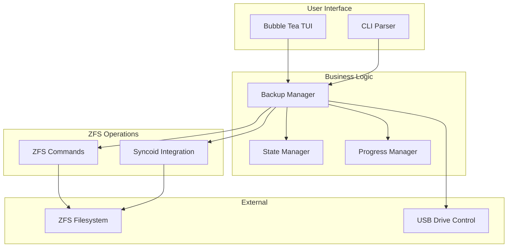
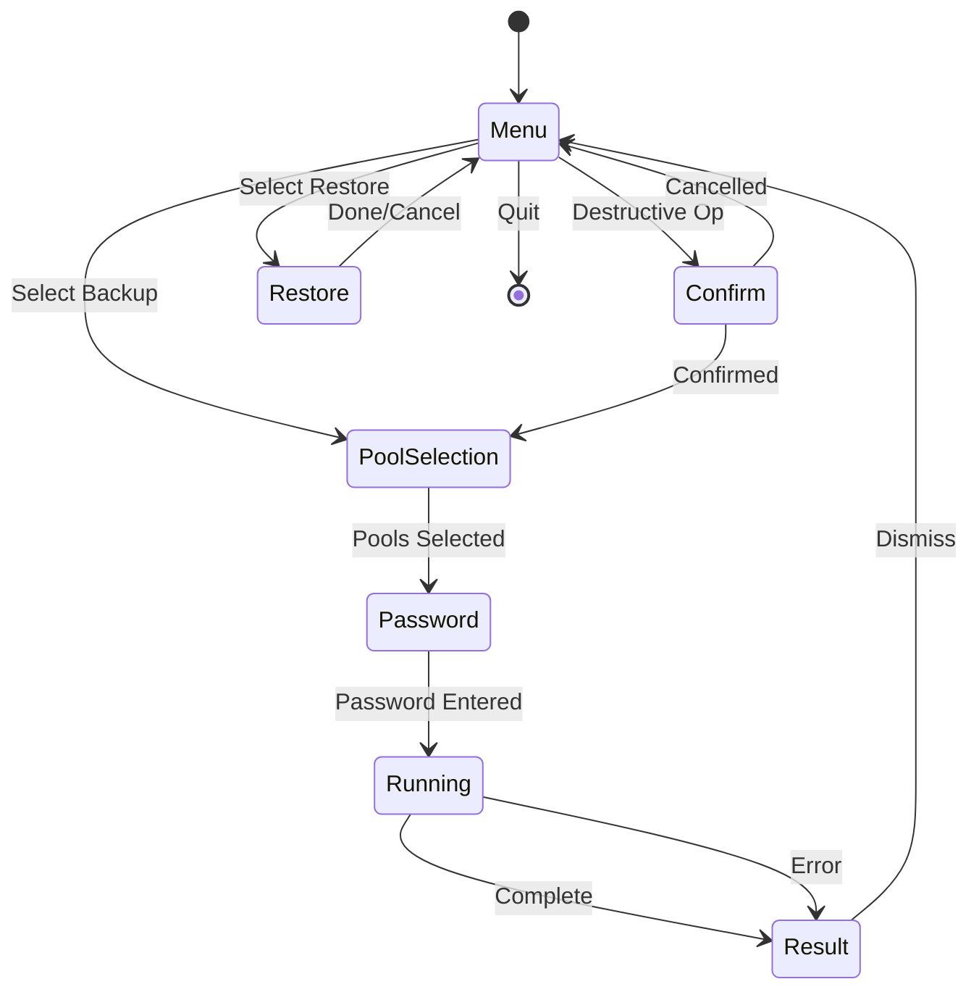

# ZFS Backup Tool - Specification

This document provides a complete technical treatment of the Kartoza ZFS Backup Tool including architecture, user stories, functional requirements, and testing requirements.

## Overview

A Terminal User Interface (TUI) application for managing ZFS backups to external drives, built with Go and the Charm libraries (Bubble Tea, Bubbles, Lipgloss).

## Architecture

### Component Diagram

### File Structure

| File | Purpose |
|------|---------|
| main.go | TUI application, views, state machine, and main logic |
| zfs.go | ZFS operations (backup, prepare, unmount) |
| state.go | Backup state management for resume functionality |
| restore.go | Restore mode with dual-panel file explorer |
| package.nix | Nix package definition |
| module.nix | NixOS module |
| flake.nix | Nix flake configuration |

### State Machine

## User Stories

### US-001: Incremental Backup
**As a** system administrator
**I want to** perform incremental backups of my ZFS filesystems
**So that** I can efficiently protect my data with minimal storage and time overhead

**Acceptance Criteria:**
- Imports and unlocks the encrypted backup pool
- Creates timestamped snapshots
- Uses syncoid for incremental data transfer
- Prunes old snapshots automatically
- Generates backup health report
- Safely exports pool on completion

### US-002: Force Backup
**As a** system administrator
**I want to** perform a force backup when incremental chains are broken
**So that** I can reset the backup state and continue protecting my data

**Acceptance Criteria:**
- Requires explicit confirmation (destructive operation)
- Deletes existing snapshots on backup disk
- Performs full backup from current state
- Warns user about data loss implications

### US-003: Restore Files
**As a** user
**I want to** browse ZFS snapshots and restore individual files
**So that** I can recover specific files without restoring entire datasets

**Acceptance Criteria:**
- Dual-panel Midnight Commander-style interface
- Left panel shows snapshots and their contents
- Right panel shows filesystem for destination selection
- Navigate with vim/yazi keybindings (hjkl, g/G, Ctrl+u/d)
- Select files with spacebar
- Copy selected files with 'y' (yank)
- Preserve file ownership, permissions, and timestamps
- Two restore modes: original location or current folder
- Create directories in destination panel with 'm'

### US-004: Prepare Backup Device
**As a** system administrator
**I want to** prepare new external drives for encrypted ZFS backups
**So that** I can add new backup media to my rotation

**Acceptance Criteria:**
- Two-phase input: prompts for device path, then pool name (defaults to NIXBACKUPS)
- Requires confirmation with clear destructive warning
- Clears existing ZFS labels on the device
- Wipes all filesystem signatures using wipefs
- Creates GPT partition table using sgdisk
- Creates encrypted ZFS pool with:
  - AES-256-GCM encryption
  - Passphrase-based key format
  - ZSTD compression
  - atime disabled for performance
- Uses `-f` flag to force pool creation
- Interactive passphrase prompt during pool creation

### US-005: Safe Unmount
**As a** user
**I want to** safely unmount and power off backup drives
**So that** I can physically disconnect drives without data corruption

**Acceptance Criteria:**
- Exports ZFS pool properly
- Powers off USB drive
- Confirms successful completion

### US-007: View Pool Information
**As a** system administrator
**I want to** view detailed ZFS pool information
**So that** I can monitor pool health, structure, and usage

**Acceptance Criteria:**
- Prompt user to select which pool to view
- Import pool if not already imported
- Unlock encrypted pools if needed (prompt for password)
- Display zpool status (structure, state, health)
- Display zpool list with usage information
- Display all datasets with usage and mountpoints
- Display snapshots with usage and creation dates
- Scrollable viewport that respects header/footer bounds
- Keyboard navigation (j/k, arrows, page up/down)

### US-008: Pool Maintenance
**As a** system administrator
**I want to** perform maintenance operations on ZFS pools
**So that** I can ensure data integrity through regular scrubs

**Acceptance Criteria:**
- Prompt user to select which pool to maintain
- Import pool if not already imported
- Unlock encrypted pools if needed (prompt for password)
- Display current pool status including any ongoing scrub/resilver
- Start a new scrub with 's' key
- Stop an in-progress scrub with 'x' key
- Refresh status display with 'r' key
- Show pool health metrics (size, allocated, free, fragmentation)
- Scrollable viewport for detailed status information

### US-006: Resume Interrupted Backup
**As a** system administrator
**I want to** resume interrupted backups from where they stopped
**So that** I don't lose progress due to interruptions

**Acceptance Criteria:**
- State saved to ~/.cache/zfs-backup/backup-state.json
- Prompts to resume on startup if interrupted state exists
- Continues from the interrupted stage

### US-009: Remote Backup
**As a** system administrator
**I want to** pull ZFS backups from remote hosts via SSH
**So that** I can consolidate backups from multiple machines onto one external drive

**Acceptance Criteria:**
- Prompts for SSH connection string (user@host)
- Prompts for remote dataset path (e.g., NIXROOT/home)
- Selects local backup pool as destination
- Uses syncoid over SSH to pull incremental data
- Namespaces backups by remote hostname (DESTPOOL/<hostname>/dataset)
- Supports SSH key-based authentication
- Imports/unlocks destination pool before sync
- Safely exports pool on completion

### US-010: Multi-Host Backup
**As a** system administrator
**I want to** store backups from multiple hosts on the same backup drive
**So that** I can use one external drive for all my machines

**Acceptance Criteria:**
- Backups are namespaced by hostname on the backup pool
- New local backups use DESTPOOL/<hostname>/home format
- Backward compatible: existing flat DESTPOOL/home paths continue to work
- Remote backups always use hostname namespacing
- Different hosts' backups don't interfere with each other

### US-012: Push Backup to Remote
**As a** system administrator
**I want to** push local ZFS snapshots to a remote backup server
**So that** I can maintain off-site backups without requiring local external drives

**Acceptance Criteria:**
- Prompts for remote host SSH connection string (or select from saved hosts)
- Prompts for remote destination pool name (e.g., NIXBACKUPS)
- Selects local source pool
- Creates recursive snapshot of all local datasets
- Pushes all datasets via syncoid over SSH
- Namespaces backups by local hostname on remote pool
- Prunes old local snapshots after sync

### US-013: All-Dataset Backup
**As a** system administrator
**I want to** back up ALL datasets in my source pool (not just home)
**So that** my entire system state is protected

**Acceptance Criteria:**
- Automatically discovers all child datasets of source pool
- Skips non-mounted datasets (mountpoint "-") such as application-specific datasets
- Creates recursive snapshots (all datasets at once)
- Syncs each dataset individually via syncoid
- Pre-creates destination datasets before sync to prevent hangs on new datasets
- Per-dataset progress bar and snapshot dot matrix during sync
- Snapshot dots use Kartoza brand colors: gray=pending, orange=syncing, blue=done, red=error
- Errors shown only via dot colors during sync; full error details in final report
- Final report includes per-dataset timing, sizes, snapshot counts, and error details
- Continues to next dataset if one fails (non-fatal)
- Per-dataset timeout prevents infinite hangs
- Applies to local backup, remote pull, and push operations
- Report written to markdown and PDF at end of each backup
- Reports saved to ~/.local/share/zfs-backup/reports/
- Filename: {Operation}-{Source}-to-{Dest}-{DDMonYYYY}-{HHhMM}-Report.{md,pdf}
- PDF generated natively using go-pdf/fpdf (no external dependencies)
- Both reports contain all sections: narrative summary, technical summary, dataset sync results table, backup tree, pool inventory (source and destination), operation log, and next steps
- Pool inventory includes: pool usage (zpool list -v), dataset table (name, used, available, refer, mountpoint, quota, compression), pool status (zpool status), and snapshot listing
- PDF and markdown reports are feature-equivalent

### US-014: Saved Host Profiles
**As a** user
**I want** remote host connection details to persist across sessions
**So that** I don't have to re-enter them every time

**Acceptance Criteria:**
- Host profiles saved to ~/.config/zfs-backup/hosts.json
- Shows saved hosts when starting a remote operation
- Option to add new host or select existing
- Option to delete saved hosts (d key)
- New hosts automatically saved after first use
- Stores SSH connection string and dataset/pool name

### US-015: Quota Management
**As a** system administrator
**I want to** view and edit ZFS dataset quotas from within the TUI
**So that** I can control disk space usage without memorizing ZFS commands

**Acceptance Criteria:**
- Shows table of all datasets with name, type, quota, used, available
- Allows editing quotas inline with enter/e key
- Shows help text explaining unit notation (T, G, M, K)
- Grays out datasets that don't support quotas (zvols)
- Can remove quotas by entering "none" or pressing n
- Shows pool total size and free space for reference
- Refreshes after each quota change
- Pool selection with unlock flow before showing quotas

### US-011: Smart Pool Defaults
**As a** user
**I want the** source and destination pools to be intelligently pre-selected
**So that** I don't have to manually select pools every time

**Acceptance Criteria:**
- Source pool defaults to first pool WITHOUT "BACKUP" in its name (case-insensitive)
- Destination pool defaults to first pool WITH "BACKUP" in its name (case-insensitive)
- Pool selection cursor pre-positions on the smart default
- Falls back gracefully if no matching pool is found

## Functional Requirements

### FR-001: Main Menu Structure
The main menu shall display items in this order:
1. Backup ZFS (incremental)
2. Remote Backup ZFS
3. Restore Files
4. Show zpool info
5. Pool Maintenance
6. Recover Failed Backup
7. Unmount Backup Disk
8. Help
9. Exit
10. --- Danger Zone ---
11. Prepare Backup Device
12. Force Backup ZFS (destructive)

Navigation skips the separator when using up/down keys.

### FR-002: Pool Selection
- Display all available ZFS pools (imported and importable)
- Allow selecting source and destination pools
- Smart defaults: source prefers non-BACKUP pool, dest prefers BACKUP pool
- Pre-select smart default in pool list cursor position
- Show pool names and encryption status
- Support both interactive and CLI modes

### FR-003: Password Handling
- Prompt for encryption passphrase when needed
- Mask password input
- Support separate passphrases for source and destination pools
- Validate pool unlock before proceeding

### FR-004: Progress Display
- Show current stage and total stages
- Display progress percentage where applicable
- Show spinner for indeterminate operations
- Display operation output in real-time

### FR-005: Restore File Browser
- Snapshot list with scrolling support
- File browser within snapshots
- ".." entry at top for parent navigation
- Sort modes: name, size, date
- Search functionality with '/'
- File selection with spacebar
- Multi-file selection support
- Directory creation with 'm' key

### FR-006: File Preservation
When restoring files:
- Preserve original UID/GID ownership
- Preserve original file permissions
- Preserve original modification timestamps
- Handle symlinks correctly (use lchown)

### FR-007: Keyboard Shortcuts

#### Main Menu
| Key | Action |
|-----|--------|
| ↑/k | Navigate up |
| ↓/j | Navigate down |
| Enter | Select option |
| ? | Show help |
| q | Quit application |
| Ctrl+C | Force quit |
| K | Open Kartoza website |
| O | Open Donate page |
| G | Open GitHub page |

#### Restore Mode
| Key | Action |
|-----|--------|
| h/l or Tab | Switch panels |
| j/k | Navigate up/down |
| g/G | Go to top/bottom |
| Ctrl+u/d | Page up/down |
| Enter | Enter directory/snapshot |
| Space | Toggle selection |
| y | Yank (copy) selected files |
| / | Search |
| s | Cycle sort mode |
| m | Create directory |
| u | Unmount and power off |
| ? | Show help |
| Esc | Go back one level |
| q | Return to menu |

### FR-008: Escape Navigation
- Escape should navigate back through states, not immediately exit
- From restore explorer: if in snapshot, go to snapshot list; else go to source selection
- From pool selection: return to menu
- From password entry: return to previous state
- Only exit application from top-level menu

### FR-009: CLI Mode
Support command-line flags for automation:
- `--backup`: Run incremental backup
- `--force-backup`: Run force backup (destructive)
- `--unmount`: Unmount backup disk
- `--help`: Show help

## Non-Functional Requirements

### NFR-001: Visual Design
- Kartoza brand colors (Gold #DF9E2F, Blue #569FC6, Teal #06969A, Red #CC0403)
- Responsive layout adapting to terminal size
- Fixed header and footer
- Scrollable content area
- Minimal, text-based UI without emojis for better terminal compatibility
- Per-dataset progress visualization during sync stage:
  - Global progress bar for overall backup stages
  - Individual dataset status shown as colored dots in a vertical list
  - Gray circle (○) = pending, Orange spinner = syncing, Blue dot (●) = done, Red dot (●) = error
  - Summary line showing datasets synced count and error count
  - Inline error messages for failed datasets
  - Legend bar explaining dot colors

### NFR-002: Error Handling
- Clear error messages displayed to user
- Errors saved to state for resume functionality
- Non-destructive operations recover gracefully
- Destination datasets are pre-created before syncoid runs to prevent hangs when a new dataset appears on the source pool
- Per-dataset syncoid timeout (4 hours) prevents a single stuck sync from blocking the entire backup
- Remote destination datasets are created via SSH before push operations

### NFR-003: Dependencies
- Go with Bubble Tea, Bubbles, Lipgloss
- ZFS utilities (zpool, zfs commands)
- syncoid (from sanoid package)
- udisks2 for USB drive control

## Testing Requirements

### TR-001: Unit Tests
- State management (save/load/clear)
- File operations (copy with attributes)
- Menu navigation logic

### TR-002: Integration Tests
- ZFS pool operations (mock or test pools)
- Backup workflow stages
- Restore file selection and copy

### TR-003: Manual Testing
- Full backup cycle on test system
- Restore individual files and verify attributes
- Device preparation on test drive
- Resume after interruption

## Version History

| Version | Date | Changes |
|---------|------|---------|
| 1.5.0 | 2026-05 | Comprehensive PDF and markdown reports with full pool inventory (datasets, sizes, quotas, compression, snapshots), narrative summary, operation log, and next steps |
| 1.3.0 | 2026-05 | Added pull/push remote backup via SSH; multi-host support with hostname namespacing; all-dataset backup; smart pool defaults; saved host profiles; fixed force backup flow |
| 1.2.0 | 2026-03 | Added "Pool Maintenance" with scrub control; fixed pool import/unlock flow; scrollable result reports |
| 1.1.0 | 2026 | Added "Show zpool info" feature; simplified UI by removing emojis |
| 1.0.0 | 2025 | Initial release with backup, restore, prepare, unmount |

---

Made with :heart: by [Kartoza](https://kartoza.com) | [Donate!](https://github.com/sponsors/kartoza) | [GitHub](https://github.com/kartoza/zfs-backup)
