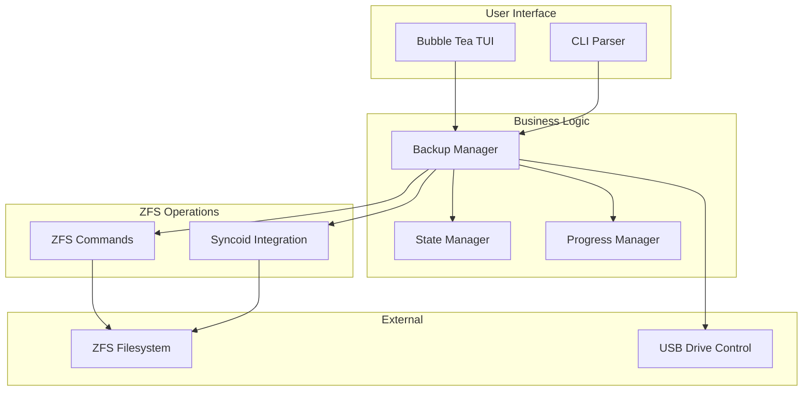
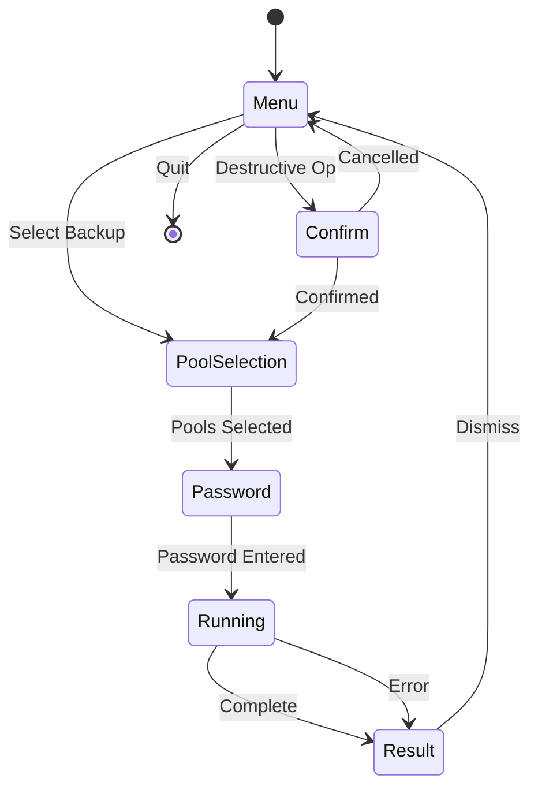
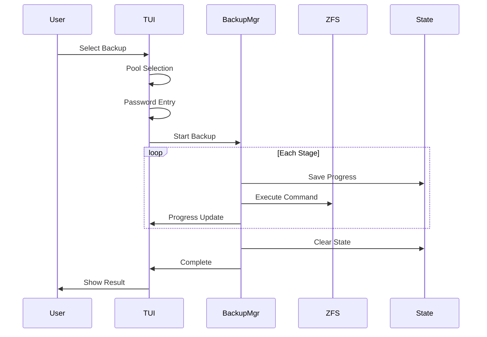

# Architecture

This document describes the architecture of Kartoza ZFS Backup Tool.

## Overview

The application is built using:

- **Go** - Programming language
- **Bubble Tea** - TUI framework
- **Lipgloss** - Terminal styling
- **Bubbles** - TUI components (spinner, progress, text input)

## Project Structure

```
zfs-backup/
├── main.go           # TUI application, views, and main logic
├── zfs.go            # ZFS operations (backup, prepare, unmount)
├── state.go          # Backup state management for resume
├── package.nix       # Nix package definition
├── module.nix        # NixOS module
├── flake.nix         # Nix flake configuration
├── flake.lock        # Nix flake lock file
├── go.mod            # Go module definition
├── go.sum            # Go dependencies checksum
├── Makefile          # Build automation
└── docs/             # MkDocs documentation
```

## Component Diagram



## Key Components

### main.go

The main application file containing:

- **Model** - Application state structure
- **Update** - State transitions and event handling
- **View** - UI rendering
- **Components** - Header, footer, menus, dialogs

#### State Machine



### zfs.go

ZFS operation implementations:

- `performBackup()` - Incremental backup with 7 stages
- `performForceBackup()` - Destructive backup with 5 stages
- `performPrepare()` - Create encrypted pool
- `performUnmount()` - Export and power off

#### Progress Channel

Operations send progress updates via a channel:

```go
type progressUpdate struct {
    stage       string
    stageNum    int
    totalStages int
    state       *BackupState
}
```

### state.go

Backup state persistence for resume functionality:

- `BackupState` - State structure
- `SaveBackupState()` - Persist to disk
- `LoadBackupState()` - Load from disk
- `ClearBackupState()` - Remove state file

State is stored in: `~/.cache/zfs-backup/backup-state.json`

## Data Flow

### Backup Operation



## Styling System

The application uses Kartoza brand colors:

| Color | Hex | Usage |
|-------|-----|-------|
| Gold | #DF9E2F | Primary, highlights |
| Blue | #569FC6 | Secondary, info |
| Gray | #8A8B8B | Subtle text |
| Teal | #06969A | Status, success |
| Red | #CC0403 | Errors, warnings |

### DRY Components

Header and footer are rendered by reusable functions:

- `renderHeader(width, status)` - Title, tagline, status line
- `renderFooter(width, hotkeys, page, total)` - Pagination, hotkeys, credits

## Error Handling

Errors are handled at multiple levels:

1. **Command errors** - Wrapped with context
2. **Stage errors** - Saved to state for resume
3. **User-facing errors** - Displayed in result view

## Concurrency

- Backup operations run in a goroutine via `tea.Cmd`
- Progress updates sent via buffered channel
- Context cancellation for graceful abort
- Spinner animation via `tea.Tick`

---

Made with :heart: by [Kartoza](https://kartoza.com) | [Donate!](https://github.com/sponsors/kartoza) | [GitHub](https://github.com/kartoza/zfs-backup)
