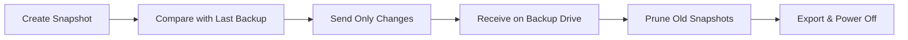

# Backup Operations

This guide explains each backup operation available in Kartoza ZFS Backup Tool.

## Incremental Backup

The primary backup method, using ZFS's efficient incremental send/receive.

### How It Works



### Stages Explained

#### 1. Import Pool

ZFS pools on external drives must be "imported" before use. This makes the pool available to the system without mounting individual filesystems yet.

#### 2. Load Encryption Key

Your backup pool uses ZFS native encryption (AES-256-GCM). The encryption key must be loaded before any data can be read or written. Data at rest remains encrypted on disk.

#### 3. Create Snapshot

A ZFS snapshot captures the exact state of your data at this moment. Snapshots are:

- **Instant** - Created in milliseconds regardless of data size
- **Space-efficient** - Only store differences from the live filesystem
- **Read-only** - Cannot be modified, ensuring data integrity

#### 4. Incremental Sync

Syncoid uses ZFS send/receive to transfer only the changes (deltas) since the last backup. This is much faster than copying all files because:

- Data is transferred at the block level
- Only changed blocks are sent
- Compression is applied to the data stream

#### 5. Prune Local Snapshots

Old snapshots on your local system are converted to **bookmarks**. Bookmarks are tiny markers that allow future incremental sends without keeping the full snapshot data locally. This saves disk space while preserving backup continuity.

!!! info "Retention Policy"
    By default, the last 7 local snapshots are kept. Older ones are converted to bookmarks.

#### 6. Prune Backup Snapshots

Old snapshots on the backup drive are pruned to save space. The retention policy keeps:

- Recent snapshots
- Monthly archives for the last 3 months

Pruned snapshots are converted to bookmarks first to maintain the incremental backup chain.

#### 7. Export & Power Off

Exporting the pool ensures all data is flushed to disk and the pool metadata is cleanly written. The USB drive is then powered off safely, allowing you to physically disconnect it.

!!! danger "Important"
    Never unplug without exporting first - this prevents data corruption!

---

## Force Backup

A destructive operation that resets the backup to match your current source state.

### When to Use

- The incremental chain is broken
- Backup snapshots are corrupted
- You want to start fresh

### Warning

!!! danger "Destructive Operation"
    Force backup will **DELETE** all existing snapshots on the backup drive. This cannot be undone!

### How It Works

1. Import and unlock the backup pool
2. Create a new snapshot on source
3. Use `syncoid --force-delete` to reset the backup
4. List resulting snapshots

---

## Prepare Backup Device

Creates a new encrypted ZFS pool on an external drive.

### Requirements

- An external drive (USB, etc.)
- The drive must be unmounted
- You'll need to provide a passphrase

### What Gets Created

```
Pool: [Your chosen name]
├── Encryption: AES-256-GCM
├── Key Format: Passphrase
├── Compression: ZSTD
└── Atime: Disabled (for performance)
```

!!! danger "Data Loss Warning"
    This operation will **ERASE ALL DATA** on the selected device!

### Steps

1. Select "Prepare Backup Device" from the menu
2. Enter the device path (e.g., `/dev/sda`)
3. Confirm the operation (double confirmation required)
4. Enter your chosen passphrase
5. Confirm the passphrase

---

## Unmount Backup Disk

Safely exports the backup pool and powers off the USB drive.

### Why This Matters

Simply unplugging a drive can cause:

- Incomplete writes
- Corrupted metadata
- Lost snapshots

The unmount operation ensures:

1. All pending writes are flushed
2. Pool metadata is cleanly written
3. The drive is electrically powered off

### Usage

1. Select "Unmount Backup Disk" from the menu
2. Choose the pool to unmount
3. Wait for confirmation
4. Physically unplug the drive

---

Made with :heart: by [Kartoza](https://kartoza.com) | [Donate!](https://github.com/sponsors/kartoza) | [GitHub](https://github.com/kartoza/zfs-backup)
